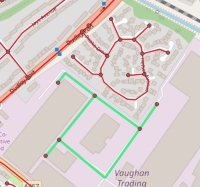

# stationdemandr 0.3.0

- converted main.R script into `sdr_submit()` function that takes database connection details
and directory path (for inputs and outputs) as arguments. User must set the database
user password using `key_set()`.
- several additional configuration options via config.csv: testing, loglevel and cores
- some additional input checks.
- now check whether the postcode-polygons table is present in the data schema. If it
isn't then the catchment will only consist of postcode centroids. This is because the
OS postcode polygons dataset is not open data.
- Results are now pulled from postgreSQL into an output folder. Includes forecasts and
catchments in GeoJSON format.

## Data Issues

- data.stations table updated to amend car parking spaces:
  - Apperley Bridge: NRE states 98 spaces. However, at: https://www.wymetro.com/corporate/news/projects/apperley-bridge-new-rail-station/ from West Yorkshire Combined Authority, clearly states that the station opened with 297 spaces. Also confirmed, here: https://www.westyorks-ca.gov.uk/projects/west-yorkshire-plus-transport-fund/rail-park-and-ride-phase-1-apperley-bridge/
  - Fishguard and Goodwick. Originally appears to have had 23 spaces (See: http://fishguardtrains.info/?p=381.) Although it does appear to have recently been expanded but no information on current number of spaces. Unclear on Google Earth the exact number.
  - Kemble: NRE states 220 spaces. Actual is 339. (See: https://www.apcoa.co.uk/parking-in/kemble/kemble-station/). 
  

# stationdemandr 0.2.4

## Model changes

- switched to using the calibrated trip-end model with jobs within 2-minute drive time. 
Equates to 1 mile at 30mph (so approx 20-minute walk distance). More likely to 
capture nearby workplace zones where the centroid is not near a road edge. (#10)

## Fixes

- added new script `start.R`. This simply calls main.R using `source()`. `start.R` can
then be run from the terminal using rscript. If main.R is called directly using 
rscript then `stop()` calls will not terminate the model.

- problem if category was 'F'. Type was not specified when stations.csv read nor
when proposed_stations table written to database. When category was 'F' type Boolean
was assumed by default. Must be type text.

- pre-flight checks
  * allow space in station name
  * allow car park spaces to be zero

- the location_geom column in proposed_stations is used by the SQL function to measure
distances from postcode centroids to the proposed station. This should therefore be generated
from the proposed station's *access* NGR. However, this was instead being generated
(in main.R) using the station's physical location NGR. This has been corrected.

- bug in `sd_generate_choicesets`. When  `sdr_crs_pc_nearest_stationswithpoints()` is called
`crs` is passed as the third argument of the function. This parameter is used in
`sdr_crs_pc_nearest_stationswithpoints()` to avoid
expensive distance lookups when the proposed or at_risk station is not in the set of stations
to be measured. This is fine for generating  a choiceset for a proposed station, 
or for a *before* abstraction analysis choiceset. However, this is the wrong parameter
if an *after* abstraction analysis is being carried out as in that case `crs` contains
the proposed station CRS not the at-risk station. This has been corrected to use pc_crs instead.

- expanded station service areas to include 2, 3 and 4km. Should improve performance of choiceset
generation process.

## Data Issues

- In the table data.hhsize there were trailing spaces in some of the area_code values.
This requires correcting by running:
`update data.hhsize set area_code = trim(area_code)`

- additional service areas (2, 3, and 4km) added to data.stations table

- data.stations table updated with car parking spaces for Great Northern stations. 
NRE shows these stations as having a car park but no spaces information. These car
parks are run by Saba and details of spaces was obtained from [https://www.sabaparking.co.uk/great-northern-railway](https://www.sabaparking.co.uk/great-northern-railway).

- data.stations table updated with date station opened (where recorded).

- data.stations table updated to amend car parking spaces:
  - Ilkeston NRE states a car park but gives no spaces. Appears that there are 150 spaces,
    in two car parks either side of the tracks. Source: https://anonw.com/tag/ilkeston-station/.
    Photo of one of the car parks suggests 150 is probably about right:[photo](https://anonw.files.wordpress.com/2017/04/dscn0019.jpg?w=1200&h=)
  - Kenilworth - NRE states a car park but gives no spaces. Managed by Saba. Their website states 71 spaces. See: https://www.sabaparking.co.uk/car-park/kenilworth-station-car-park
  - Pye Corner, Newport - NRE states car par but doesn't give spaces. According to BBC article there are 70 spaces: https://www.bbc.co.uk/news/uk-wales-south-east-wales-22550481. Google Maps satellite view indicate  60-65.
  
- Bus services. The following stations change from NA to TRUE:
  * Kirkstall Forge
  * Lea Bridge
  * Bermuda Park
  * Oxford Parkway  
  * Apperley Bridge
  * Pye Corner
  
- Bus services. The following stations change from NA to FALSE:
  * James Cook University Hospital
  
  

# stationdemandr 0.2.3

## Performance improvements

- Modified `sdr_create_json_catchment()` to improve catchment display performance.
Probability is now rounded to 1 decimal places and then st_union is used to 
dissolve the postcode polygons, grouped by probability. The GeoJSON is then
generated. This means that any catchment will now have a maximum feature count 
of 10. Also defined `maxdecimaldigits` for `st_asgeojson`, set to 5 rather than 
the default of 15.

# stationdemandr 0.2.2

## Fixes

- Fixed issue with the BEFORE abstraction analysis. Frequency group adjustments 
were not applied to the *before* situation - there was a single shared
probability table for each at_risk station. This appeared to make sense when the
decision was made. However, if one of the at-risk stations is also subject to an
upward frequency adjustment then its weighted population will increase in the
*after* situation (because of the higher frequency variable). This has been
amended so that a separate probablity table is created for each 
proposed_station:at_risk station pair (the same as for the *after* analysis) and
frequency group adjustments are made as required.

# stationdemandr 0.2.1

## Fixes

- Fixed bug with main script not able to handle empty data frames resulting from 
import of empty exogenous.csv and freqgroups.csv input files (which are optional).

# stationdemandr 0.2.0

## Fixes

- Fixed bug with parallel logging
- Fixed bug in `sdr_create_service_area()`. `ST_ConcaveHull` can return a point or line
in some circumstances. Need to apply a buffer to ensure sa is a polygon and can be
written to table.
- Fixed bug in SQL function `sdr_crs_pc_nearest_stationswithpoints()` - in the select
case 60km and 80km service areas were incorrectly specified as 30km and 40km.
- Regexp for job_id pre-flight check amended to allow  20 character length.

## New/amended features

- Import Boolean variables as logical - ensures they are all TRUE or FALSE which
are also valid Boolean PostgreSQL values.
- Argument **columns** added to `sdr_create_service_areas()` (logical) to indicate
whether the service area columns should be created. Increases flexibility of
function.
- Column name changed from **dailyfrequency_2017_all** to **frequency** in stations 
table and `sdr_generate_probability_table()` function amended.
- Column name changed from **entsexits2017** to **entsexits** in stations table and
main
script amended appropriately.
- Additional pre-flight check for **region** field.
- `sapply` replaced with `vapply` throughout. Preferred as `sapply` is not type safe.

## Performance improvements

- Views previously used in `sdr_generate_choicesets()` replaced with materialized
views.
- Various indexes (incl. spatial) now created for the materialized views.

## Data issues

- Removed any edges and nodes disconnected from the main network graph from the 
OS OpenRoads tables. The affected nodes were identified using the pgRouting 
function `pgr_connectedComponents()` and were then used to delete affected edges from 
openroads.roadlinks and nodes from openroads.roadnodes. This deals with potential
problem of the nearest edge to a postcode or station not being connected to the 
rest of the road network (a potential issue for routing and building station 
service areas). Centroidnodes and roadlink virtual node tables regenerated. Example
disconnected network (in green) shown below:

  

- Full stations data created (up-to-date with latest station openings and closures).
- Service frequency updated from latest timetable data.
- Services and facilities updated from NRE KB.
- Full postcode centroid and population data.
- Full workplace zone centroid and population data. Also includes workplace zones
for Scotland (previously not available from Census Scotland - postcode centroids
previously used).

# stationdemandr 0.1.0

Initial release

